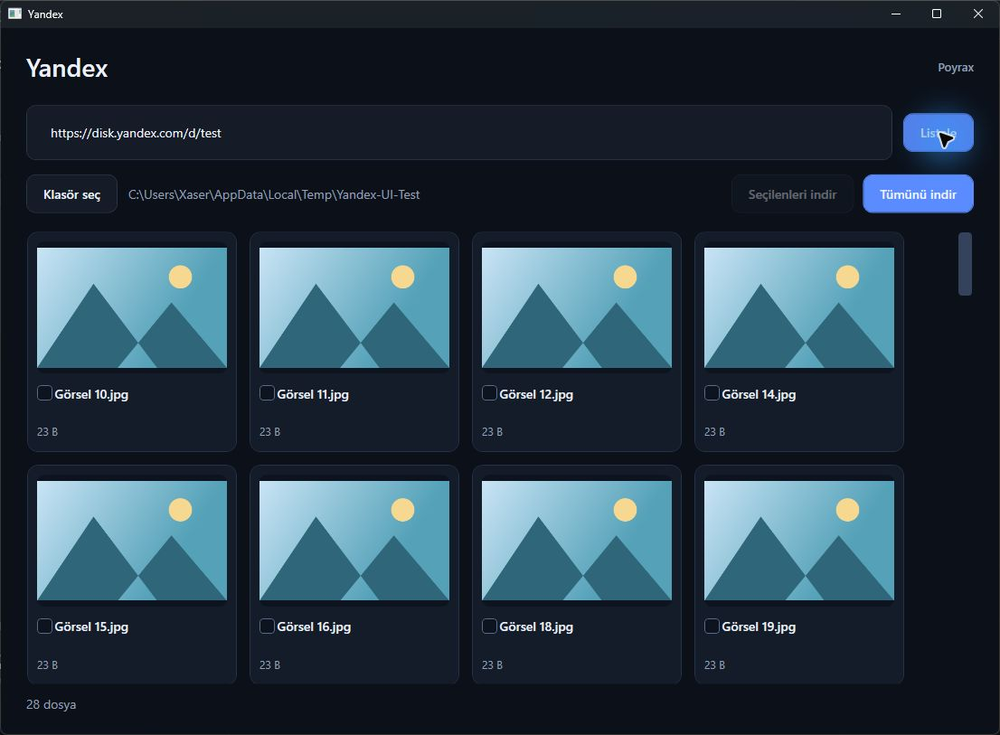
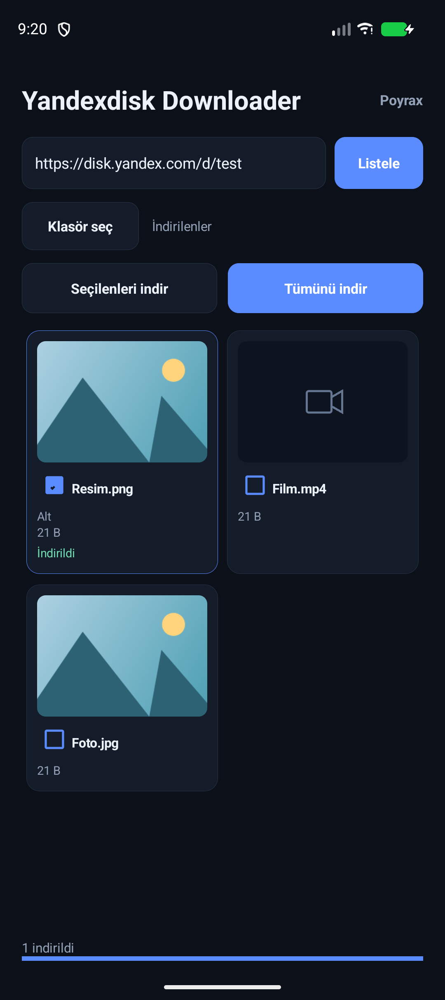

# Yandexdisk Downloader

[English](#english) · [Türkçe](#türkçe)

## English

Download videos and images from public Yandex Disk links on Windows and Android. Select files from the gallery or download all media, including files in subfolders.

Dark theme, Turkish interface. Developed by [Poyrax](https://github.com/Poyraxx).

### Download and install

| Platform | Download | Requirements |
| --- | --- | --- |
| Windows | [Yandex.exe](https://github.com/Poyraxx/yandexdisk-video-downloader/releases/latest/download/Yandex.exe) | Windows 10 or later, 64 bit |
| Android | [Yandex.apk](https://github.com/Poyraxx/yandexdisk-video-downloader/releases/latest/download/Yandex.apk) | Android 8.0 or later |

All versions are on the [Releases](https://github.com/Poyraxx/yandexdisk-video-downloader/releases) page. You do not need the source code to use the app.

**Windows:** Download `Yandex.exe`, put it in a folder and open it. No installer or separate .NET installation is needed. To remove the app, delete the EXE; downloaded files stay in your chosen folder.

**Android:** Download `Yandex.apk` to your phone and open it. If Android asks, allow installation from the browser or file app you used to open the APK, then finish installing. The installed app is named **Yandexdisk Downloader**. It is distributed here, outside the Play Store.

The app may ask for notification permission to show download progress and a cancel button. Choose a destination using Android's folder picker; the app does not request access to all storage.

### Use

1. Paste a public Yandex Disk link into the link field.
2. Press **Listele** (List) and wait for the scan to finish.
3. Press **Klasör seç** (Choose folder) to select the destination.
4. Check files and press **Seçilenleri indir** (Download selected), or use **Tümünü indir** (Download all).
5. Press **İptal** (Cancel) to stop.

Single files and nested folders are supported. Videos and images appear in one gallery; downloads preserve their folder structure. Other file types are skipped. Original downloads keep their format. Existing files are kept, with new copies named like `photo (1).jpg`. Up to two files download at once, directly to storage.

Cancelling keeps completed files and removes incomplete files. Temporary network failures are retried a limited number of times. A failed file does not stop the others; its error appears in the gallery. Downloads remain disabled if a folder scan is incomplete.

Thumbnails load for visible items. Videos without a preview use a video icon; the app does not download a video to create its thumbnail.

On Android, downloads continue in the background with a notification. They do not resume after the app is force stopped, its process is ended by the system, or the device restarts.

### Supported links

Links must be public. If the standard download endpoint returns no address, the app checks for an original file address in Yandex's metadata. Images can also use the `ORIGINAL` address. These original downloads are saved only if their size and SHA-256 match the metadata.

If an original video address is unavailable, the app tries Yandex's public playback stream and selects the highest available resolution. Playback videos are saved as `.ts` files, with their audio and video copied without re-encoding. They are not the original uploaded file; their quality and size depend on Yandex's playback versions. Use a video player that supports MPEG-TS to open them. Download progress for playback streams uses an estimated total size until all segments are received.

This can work for some shares with downloading disabled; it is not guaranteed for every file or share. Encrypted, live and unsupported playback streams show a short error. Reduced image previews are not saved as original files.

Account login, private or password protected shares, and an in-app video player are not supported. Closed, invalid or inaccessible links show a short error. If folder permissions change, choose the folder again.

### Build from source

**Windows:** Install the [.NET 10 SDK](https://dotnet.microsoft.com/download/dotnet/10.0) on Windows, then run from the repository folder:

```powershell
dotnet publish windows/Yandex.csproj -c Release -p:PublishProfile=Windows
```

The portable EXE is written to `windows/publish/Yandex.exe`.

**Android:** Open `android` in Android Studio. Use Android SDK 37, Build Tools 36.0.0 and JDK 17 or later. The project uses Gradle 9.6 and Android Gradle Plugin 9.4. On Windows, use a path without Turkish characters, such as `C:\Projects\yandexdisk-video-downloader`.

Run from the `android` folder:

```powershell
.\gradlew.bat :app:assembleDebug
```

The debug APK is written to `android/app/build/outputs/apk/debug/app-debug.apk`.

For a release APK, create your own keystore with the alias `poyrax`. Set `YANDEX_KEYSTORE`, `YANDEX_STORE_PASSWORD` and `YANDEX_KEY_PASSWORD`, then run:

```powershell
.\gradlew.bat :app:assembleRelease
```

The output is `android/app/build/outputs/apk/release/app-release.apk`. Signing keys and passwords are excluded from the repository. Updates require the same signature; uninstall the published app first if your build uses a different key.

### Tests

From the repository folder:

```powershell
dotnet run --project windows/Tests/Yandex.Tests.csproj -c Release
dotnet run --project windows/Tests/Yandex.Tests.csproj -c Release -- --ui-check
```

From `android`:

```powershell
.\gradlew.bat :app:testDebugUnitTest
.\gradlew.bat :app:connectedDebugAndroidTest
```

Device tests require a connected device or emulator. Tests cover single files, nested folders, pagination, media filtering, selected and bulk downloads, filename collisions, interrupted transfers and cancellation using sample API responses. Original address checks cover hash mismatches, address expiry and rejecting reduced previews. Playback tests check the highest resolution, complete segments, filename collisions, retries, cancellation and rejecting unsupported streams.

A real image whose standard download address was empty was downloaded and verified against Yandex's SHA-256. A public share with downloading disabled returned video playback addresses, and its playlist was checked without fetching its video segments. A complete 1080p playback video from a separate public press share was downloaded; audio and video tracks were verified. Large file, network interruption and cancellation scenarios use sample responses.

Screenshots below use sample test files. Listing and downloads use the [Yandex Disk REST API](https://yandex.com/dev/disk-api/doc/en/). This is an independent app, not an official Yandex product.

## Türkçe

Herkese açık Yandex Disk bağlantılarındaki video ve görselleri Windows veya Android’de indirmek için küçük bir uygulama. Dosyaları galeriden seçebilir ya da bağlantının altındaki bütün medyayı tek seferde indirebilirsiniz.

Türkçe arayüz, karanlık tema. Geliştirici: [Poyrax](https://github.com/Poyraxx).

## İndir ve kur

| Platform | Dosya | Gereksinim |
| --- | --- | --- |
| Windows | [Yandex.exe](https://github.com/Poyraxx/yandexdisk-video-downloader/releases/latest/download/Yandex.exe) | Windows 10 veya üzeri, 64 bit |
| Android | [Yandex.apk](https://github.com/Poyraxx/yandexdisk-video-downloader/releases/latest/download/Yandex.apk) | Android 8.0 veya üzeri |

Bütün sürümler [Releases](https://github.com/Poyraxx/yandexdisk-video-downloader/releases) sayfasında. Çalıştırmak için depodaki kaynak kodu indirmeniz gerekmez.

### Windows

`Yandex.exe` dosyasını indirin, istediğiniz klasöre koyun ve açın. Kurulum veya ayrıca .NET yüklemesi gerekmez. Uygulamayı kaldırmak için EXE dosyasını silebilirsiniz; indirdiğiniz dosyalar seçtiğiniz klasörde kalır.

### Android

`Yandex.apk` dosyasını telefona indirin ve açın. Android isterse, APK’yı açtığınız tarayıcı veya dosya uygulaması için **Bu kaynaktan izin ver** seçeneğini kullanıp kurulumu tamamlayın. Kurulan uygulamanın adı **Yandexdisk Downloader**. Uygulama Play Store üzerinden dağıtılmıyor.

İndirme sırasında bildirim izni istenebilir. Bildirim üzerinden ilerlemeyi görebilir ve indirmeyi iptal edebilirsiniz. Dosyaların kaydedileceği klasörü Android’in klasör seçicisinden siz belirlersiniz; uygulama tüm depolamaya erişim izni istemez.

## Kullanım

1. Yandex Disk’teki paylaşım bağlantısını bağlantı alanına yapıştırın.
2. **Listele** düğmesine basın ve taramanın bitmesini bekleyin.
3. **Klasör seç** ile dosyaların kaydedileceği yeri belirleyin.
4. İstediğiniz dosyaları işaretleyip **Seçilenleri indir** düğmesine basın. Hepsi için **Tümünü indir** kullanın.
5. İşlemi durdurmak için **İptal** düğmesine basın.

Tek dosya bağlantıları ve iç içe klasörler desteklenir. Alt klasörlerdeki video ve görseller aynı galeride görünür; indirilirken klasör yapısı korunur. Diğer dosya türleri indirilmez.

Orijinal indirmelerde dosyanın biçimi korunur. Aynı isimde bir dosya varsa mevcut dosyanın üzerine yazılmaz; yenisi `foto (1).jpg` gibi bir adla kaydedilir. En fazla iki dosya aynı anda indirilir. Büyük dosyalar doğrudan diske yazılır.

İptalde tamamlanan dosyalar kalır, yarım dosyalar temizlenir. Geçici bağlantı hataları sınırlı olarak tekrar denenir. Bir dosya indirilemezse diğerleri devam eder ve hata o dosyanın altında görünür. Bir klasör tamamen taranamazsa indirme düğmeleri açılmaz.

Küçük resimler yalnızca görünür dosyalar için alınır. Video önizlemesi yoksa video simgesi gösterilir; önizleme oluşturmak için video indirilmez.

Android’de uygulama arka plandayken başlayan indirme bildirimle devam eder. Uygulamanın zorla durdurulması, işlemin sistem tarafından kapatılması veya cihazın yeniden başlaması sonrasında indirme kaldığı yerden sürmez.

## Desteklenen bağlantılar

Paylaşımın herkese açık bir Yandex Disk bağlantısı olması gerekir. Normal indirme uç noktası adres vermiyorsa Yandex'in dosya bilgilerindeki orijinal dosya adresi kontrol edilir. Görseller için `ORIGINAL` adresi de kullanılabilir. Bu yoldan alınan orijinal dosya, boyutu ve SHA-256 değeri dosya bilgileriyle eşleşirse kaydedilir.

Videonun orijinal adresi bulunamazsa Yandex'in herkese açık oynatma akışı denenir ve mevcut en yüksek çözünürlük seçilir. Oynatma videoları `.ts` dosyası olarak kaydedilir; ses ve görüntü yeniden kodlanmaz. Bu dosya, yüklenen orijinal dosyanın aynısı değildir. Kalite ve boyut Yandex'in oynatma sürümlerine bağlıdır. Açmak için MPEG-TS destekleyen bir video oynatıcı kullanın. Akış indirmelerinde bütün parçalar alınana kadar toplam boyut üzerinden gösterilen ilerleme tahminidir.

İndirmesi kapalı bazı paylaşımlarda çalışabilir; her dosya veya paylaşım için garanti verilmez. Şifreli, canlı veya desteklenmeyen video akışlarında kısa bir hata gösterilir. Küçük görsel önizlemeleri orijinal dosya olarak kaydedilmez.

Hesap girişi, özel veya şifreli paylaşımlar ve uygulama içinde video oynatma bulunmaz. Bağlantı kapalıysa, geçersizse veya dosyaya erişilemiyorsa uygulama kısa bir hata gösterir. Klasöre yazma izni değiştiğinde **Klasör seç** ile klasörü yeniden seçin.

## Ekranlar

Windows ve Android ekranları örnek test dosyalarıyla alınmıştır.





## Kaynaktan derleme

### Windows

Windows üzerinde [.NET 10 SDK](https://dotnet.microsoft.com/download/dotnet/10.0) gerekir. Depo klasöründe çalıştırın:

```powershell
dotnet publish windows/Yandex.csproj -c Release -p:PublishProfile=Windows
```

Taşınabilir EXE, `windows/publish/Yandex.exe` konumuna çıkar.

### Android

Android Studio’da `android` klasörünü açın. Android SDK 37, Build Tools 36.0.0 ve JDK 17 veya üzeri gerekir. Gradle 9.6 ve Android Gradle Plugin 9.4 proje dosyalarında tanımlıdır. Windows’ta derleme için projeyi Türkçe karakter içermeyen bir yola çıkarın; örneğin `C:\Projects\yandexdisk-video-downloader`.

Deneme APK’sı için `android` klasöründe çalıştırın:

```powershell
.\gradlew.bat :app:assembleDebug
```

Dosya `android/app/build/outputs/apk/debug/app-debug.apk` konumuna çıkar.

Dağıtım APK’sını kendi anahtarınızla imzalamak için `poyrax` takma adına sahip bir keystore oluşturun. Terminalde `YANDEX_KEYSTORE`, `YANDEX_STORE_PASSWORD` ve `YANDEX_KEY_PASSWORD` ortam değişkenlerini ayarlayıp aşağıdaki komutu çalıştırın:

```powershell
.\gradlew.bat :app:assembleRelease
```

Çıktı `android/app/build/outputs/apk/release/app-release.apk` olur. Keystore ve parolalar depoya dahil edilmez. Yayınlanan APK’nın üzerine güncelleme kurabilmek için aynı imza gerekir; kendi derlemenizin imzası farklıysa önce kurulu sürümü kaldırmanız gerekir.

## Testler

Windows kontrolleri:

```powershell
dotnet run --project windows/Tests/Yandex.Tests.csproj -c Release
dotnet run --project windows/Tests/Yandex.Tests.csproj -c Release -- --ui-check
```

Android kontrolleri, `android` klasöründen:

```powershell
.\gradlew.bat :app:testDebugUnitTest
.\gradlew.bat :app:connectedDebugAndroidTest
```

Cihaz testleri için bağlı bir Android cihazı veya çalışan bir emülatör gerekir. Windows’ta 29 indirme/API kontrolü ve 4 arayüz kontrolü; Android’de 23 birim testi bulunur. Galeri, indirme, TS dosyası kaydetme ve iptal için dört cihaz testi Android 8 ve Android 17 emülatörlerinde sınandı. Eşzamanlı video indirmelerinde anonim oturumların birbirini etkilememesi de kontrol edilir.

Testler tek dosya, alt klasörler, sayfalama, dosya türü ayrımı, seçili ve toplu indirme, isim çakışması, kesilen bağlantı ve iptali örnek API yanıtlarıyla kontrol eder. Orijinal adres için hash uyuşmazlığı, süresi dolan adresin yenilenmesi ve küçük önizlemelerin reddi sınanır. Video akışı testleri en yüksek çözünürlüğü, parçaların eksiksiz kaydedilmesini, isim çakışmasını, yeniden denemeyi, iptali ve desteklenmeyen akışların reddini kontrol eder.

Normal indirme adresi boş olan gerçek bir görsel indirildi ve Yandex'in SHA-256 değeriyle eşleştiği doğrulandı. İndirmesi kapalı bir paylaşımda video oynatma adresleri alındı; video parçaları indirilmeden oynatma listesi kontrol edildi. Ayrı bir herkese açık basın paylaşımındaki 1080p oynatma videosu tamamen indirildi; ses ve görüntü kanalları doğrulandı. Büyük dosya, ağ kesintisi ve iptal senaryoları gerçek paylaşım yerine örnek yanıtlarla sınandı.

Listeleme ve indirme için Yandex Disk’in [REST API’si](https://yandex.com/dev/disk-api/doc/en/) kullanılır. Uygulama Yandex’in resmi ürünü değildir.
